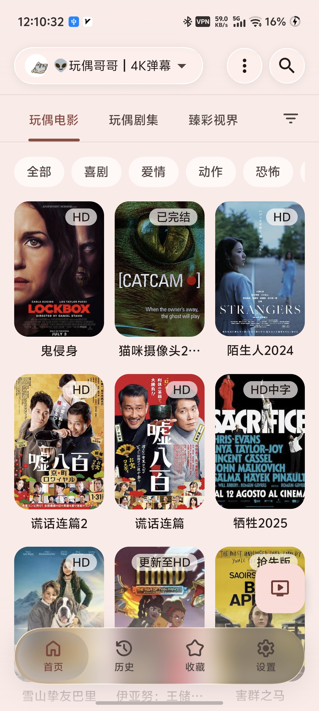
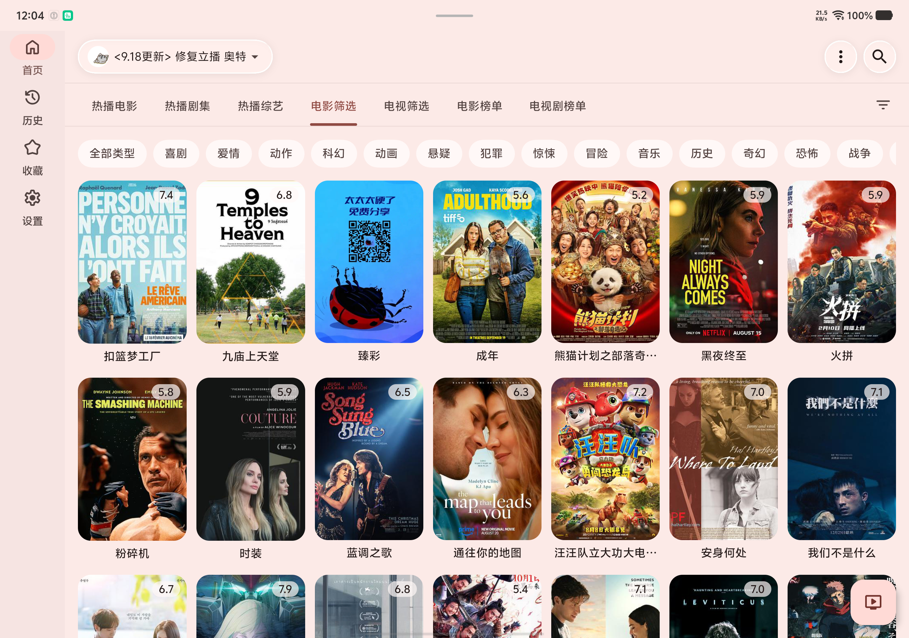

  <a href="skill/SKILL.md">Project Rules</a>

  
   
  

# AVBox（AudioVideoBox）

- 基于 https://github.com/q215613905/TVBoxOS
- 参考了 https://github.com/FongMi/TV
- 核心功能都基于两个上游项目，只是用 Jetpack Compose 重写了 UI

# 声明

- AVBox只是个空壳播放器。
- 不内置任何影视、直播、频道、节目单或订阅服务。
- 不提供任何视频内容、下载内容或版权资源。
- 项目开发者不对用户的使用行为承担任何法律责任。
- 用户应在遵守其所在国家或地区法律法规的前提下使用本软件。
- 本项目是基于技术学习和交流为目开发的开源软件。
- 本软件只提供聚合展示功能、所有资源均来自互联网，软件不参与任何**内置**、**制作**、**上传**、**储存**、**下载**等内容，也不接受任何**捐赠**、**打赏**、**付费**等谋利行为，软件仅供开源学习参考，请于安装后24小时内删除。
打包分发请保留出处
https://github.com/CatVodTVOfficial/TVBoxOSC
https://github.com/q215613905/TVBoxOS

# 截图展示

<table>
  <tr>
    <td align="center"> 首页</td>
    <td align="center"> 播放页</td>
    <td align="center"> 历史页</td>
    <td align="center"> 设置页</td>
   </tr>
</table>

  
   宽屏首页

